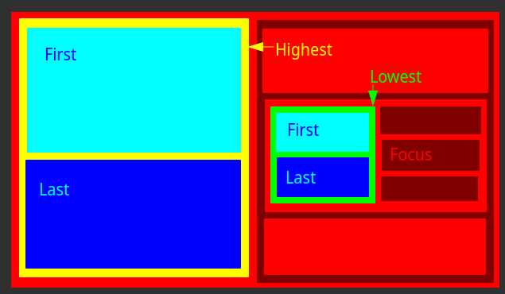

## About
This swaps two containers/windows in an i3 workspace: The focused container and
another one, depending on the picked options.
Probably works on sway as well.

## Options
In one picture:



### Layout
By default it swaps horizontal, but `--layout vertical` should work as well.
Though I did little testing since it is not that useful to me at the moment.

### Level
By default it goes up the workspace tree to find the highest horizontally
split container (depending on layout option).
You can change it to use the lowest container that is horizontally/vertically
split.

The is no middle ground. If you have a suggestion how and how it would be
useful, let me know.

### Swapee
By default the first container in the "other half" will be picked. With the
level option we found a common container. Now we need to look at the other half
and pick a candidate for swaping – the swapee. You can also pick the `--swapee
last`, if you prefer.

Like with the level option. There is no middle ground. But again, if you know
how it could be done and how it would be useful, let me know.

### Non-existent option
Currently it assumes there is only two containers in the common container and it
picks the other one. So technically there is a option missing between level and
swapee.

## Usage as Shortcuts
You probably want this to be triggered by a shortcut. The configuration for it
in i3 could look something like this:
```i3
bindsym $mod+m       exec --no-startup-id ~/.local/bin/i3-swap/i3swap.py
bindsym $mod+Shift+m exec --no-startup-id ~/.local/bin/i3swap.py --swapee last
```

## Disclaimer
I know this is a horrible name.
I just wrote this for myself but feel free to report any issues you encounter.
